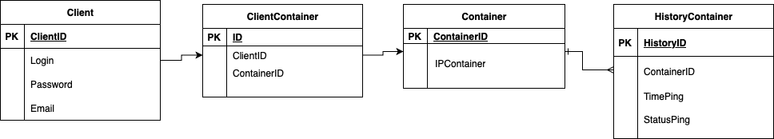

# Приложение, осуществляющее мониторинг Docker-контейнеров

### Постановка задач:

Необходимо написать приложение на языках программирования Go и JavaScript(TS), 
которое получает ip адреса контейнеров docker, пингует их
с определенным интервалом и помещает данные в базу данных.

Получение данных о состоянии контейнеров доступно динамически формируемой веб-странице.

### Технологический стек

Go, Gin, PostgreSQL, TypeScript, React, Docker, HTML, CSS, JWT, git

### Используемые сервисы

1) Backend-сервис обеспечивает RESTful API для запроса данных из DB и добавление туда новых данных.
2) Frontend-сервис предоставляет пользовательский интерфейс. Берет данные через API BAckend и отображает данные по всем IP адресам в виде таблицы.
3) База данных PostgreSQL.
4) Сервис Pinger. Получает список всех dcoker-контейнеров, пингует их и отправляет данные в базу через API Backend.

### Запуск приложения


### Пример работы 

Домашняя страница, где предложено зарегистрироваться или войти в существующий аккаунт.


Регистрация по почте, логину и паролю.


Вход в аккаунт по почте и паролю.


Таблица состояний контейнеров


### Схема Базы данных



Клонирование репозитория
```
git clone https://github.com/Mamvriyskiy/dockerPing.git 
cd dockerPing
```

Конфигурация Backend
```
cd backend/configs
touch .env #DB_PASSWORD=Smena 
cd ../../
```
Инициализация Go Modules
```
go mod init github.com/Mamvriyskiy/dockerPing
go mod tidy
```

Сборка и запуск приложения
```
cd build
docker-compose up --build
```

### Запуск

```
http://localhost:3000
```